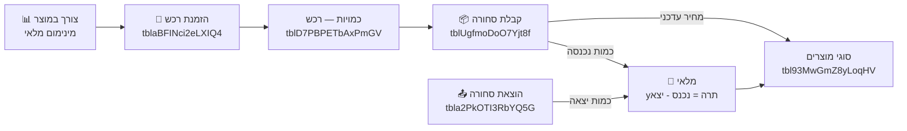
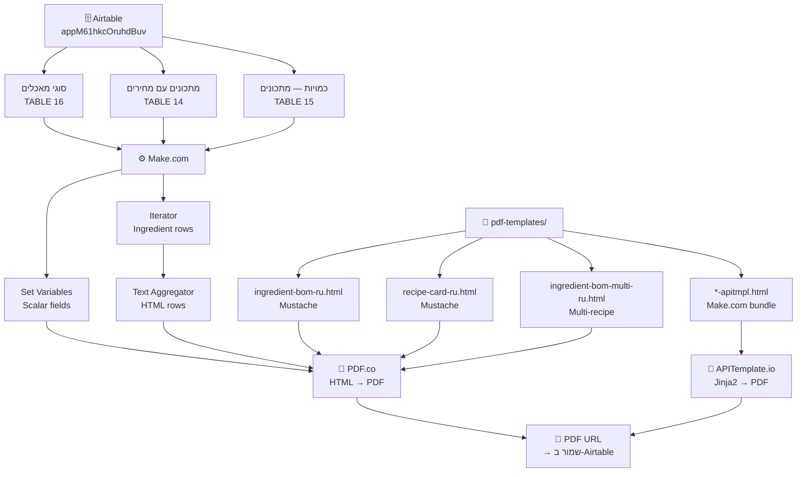
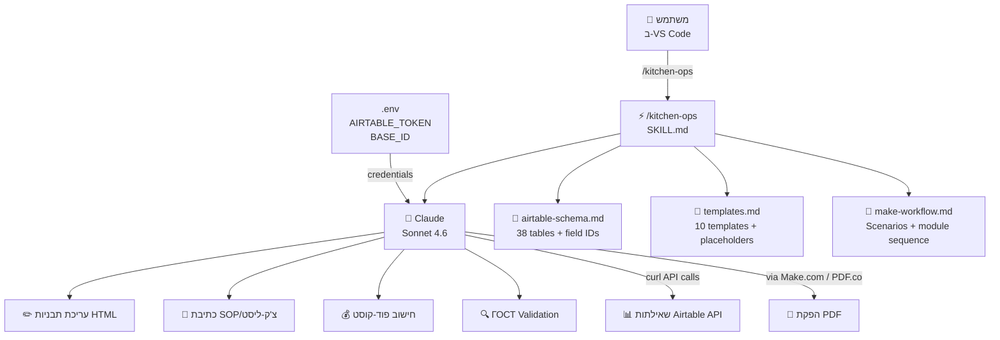

# מערכת ניהול מטבח — דיאגרמת מערכת

## חלק 1: מבנה Airtable — ליבת המטבח

```mermaid
erDiagram
    PRODUCTS["סוגי מוצרים\ntbl93MwGmZ8yLoqHV"] {
        string שם_ברוסית
        string שם_בעברית
        select יחידת_מידה
        formula מחיר_אחרון
        formula יתרה_במלאי
    }

    RECIPES["מתכונים עם מחירים\ntbl053nytobUU4ytc"] {
        number מס_סידורי
        string שם_ברוסית
        select קטגוריה
        text הוראות_הכנה
        rollup סך_נטו_גרמים
        formula משקל_אחרי_בישול
    }

    BOM["כמויות — מתכונים\ntblpmPSqC7TuzElHI"] {
        number ברוטו
        number נטו_לפני_בישול
        percent אחוז_ניקוי
        percent אחוז_בישול
        number נטו_אחרי_בישול
        formula מחיר_לרכיב
    }

    DISHES["סוגי מאכלים עם מחירים\ntblhkNaiSGBiLRUxA"] {
        string שם_ברוסית
        string שם_בעברית
        number משקל_מנה
        formula יחס_מנה
        formula עלות_חומרים
    }

    ASSEMBLY["הרכבות מאכלים\ntblCg9hg1F8oj1mQ7"] {
        number כמות_מהמתכון
        formula יחס_מנה
        formula עלות_חומרים
    }

    PRICES["טבלת מחירי מאכלים\ntblMe5ZQp6Ygfca5W"] {
        number מחיר_תג
        number עלות_חומרים
        formula אחוז_רווח
        select סטטוס_מחיר
    }

    RECIPES ||--o{ BOM : "has ingredients"
    PRODUCTS ||--o{ BOM : "used in"
    DISHES ||--o{ RECIPES : "linked to"
    DISHES ||--o{ ASSEMBLY : "composed of"
    ASSEMBLY }o--|| RECIPES : "uses recipe"
    DISHES ||--o{ PRICES : "price history"
```

---

## חלק 2: זרימת הזמנות (POS)

```mermaid
flowchart TD
    CUSTOMER["👤 לקוח / Customer"]
    ADMIN["👩‍💼 אדמין"]
    ORDERS["🛒 הזמנות אוכל מהמטבח\ntblMnlLwYCD27ou80"]
    ORDERLINES["📋 כמויות — הזמנות\ntblcP1zvc3Tu9oQuL"]
    DISHES["🍽 סוגי מאכלים\ntblhkNaiSGBiLRUxA"]
    KITCHEN["👨‍🍳 מטבח\nСтатус приготовления"]
    DELIVERY["🚗 משלוח\nСтатус доставки"]
    PAYMENT["💳 תשלומים\ntblaNK6mYqr20YtT1"]
    FEEDBACK["⭐ משוב לקוחות\ntblhdaf6K6EeEN906"]

    CUSTOMER -->|"טופס הזמנה"| ORDERS
    ADMIN -->|"Airtable Interface"| ORDERS
    ORDERS ||--o{ ORDERLINES : "contains"
    ORDERLINES -->|"מחיר × כמות"| ORDERS
    DISHES -->|"תפריט + מחיר"| ORDERLINES
    ORDERS -->|"הזמנה לביצוע"| KITCHEN
    KITCHEN -->|"מוכן"| DELIVERY
    DELIVERY -->|"נמסר"| PAYMENT
    PAYMENT -->|"שולם"| FEEDBACK
```

---

## חלק 3: זרימת רכש ומלאי



---

## חלק 4: זרימת PDF — טכ-קארטות



---

## חלק 5: ארכיטקטורת הסקיל kitchen-ops



---

---

## חלק 6: מערכת הזמנות אירועים

### 6א — טבלאות Airtable חדשות (ליצור ידנית)

#### טבלה: אולמות / Halls
| שדה | סוג | תיאור |
|-----|-----|--------|
| `שם האולם` | Text | שם תצוגה |
| `קיבולת` | Number | מספר מקסימלי של אורחים |
| `מחיר לשעה` | Currency | ₪ לשעה |
| `תיאור` | Long text | תיאור האולם |
| `תמונה` | Attachment | תמונות האולם |
| `פעיל` | Checkbox | מוצג ללקוחות |

#### טבלה: שירותי אירועים / Event Services
| שדה | סוג | תיאור |
|-----|-----|--------|
| `שם השירות` | Text | ברוסית |
| `קטגוריה` | Single select | פרסונל / כלים / ציוד / עיצוב |
| `מחיר` | Currency | ₪ ליחידה |
| `יחידה` | Text | יח', שעה, קומפלקט |
| `כמות ברירת מחדל` | Number | מוצע ללקוח |
| `סוג אירוע` | Multi select | pominki / birthday / wedding / הכל |
| `פעיל` | Checkbox | |

#### טבלה: הזמנות אירועים / Event Orders
| שדה | סוג | תיאור |
|-----|-----|--------|
| `מזהה הזמנה` | Auto number | |
| `סוג אירוע` | Single select | pominki / birthday / barmitzva / etc |
| `תאריך` | Date | |
| `שעת התחלה` | Text | HH:MM |
| `שעת סיום` | Text | HH:MM |
| `משך (שעות)` | Number | |
| `מספר אורחים` | Number | |
| `אולם` | Link to Halls | |
| `עלות אולם` | Currency | |
| `מנות` | Long text | JSON: [{id,name,qty,price}] |
| `עלות מנות` | Currency | |
| `שירותים` | Long text | JSON: [{id,name,qty,price}] |
| `עלות שירותים` | Currency | |
| `סה"כ משוער` | Currency | |
| `שם לקוח` | Text | |
| `טלפון` | Phone | |
| `אימייל` | Email | |
| `הערות` | Long text | |
| `סטטוס` | Single select | חדש / בטיפול / אושר / בוטל |
| `נשלח ב` | Date/Time | |

#### עדכון בטבלה: סוגי מאכלים עם מחירים (`tblhkNaiSGBiLRUxA`)
הוסף שדה multi-select:
- `סוג אירוע` — ערכים: pominki, birthday, barmitzva, batmitzva, torah, wedding, all

---

### 6ב — סצנריות Make.com חדשות

#### סצנריה 8a — GET אולמות (בדיקת זמינות)
```
Webhook: GET ?date=YYYY-MM-DD&start=HH:MM&end=HH:MM&guests=N

→ Airtable Search: טבלת אולמות
   Filter: {פעיל} = TRUE()
→ לכל אולם: חפש הזמנות קיימות באותו תאריך/שעה
   (שאילתה לטבלת הזמנות אירועים: {תאריך}=date AND {אולם}=hallId AND overlap)
→ הוסף שדה available=true/false
→ Text Aggregator → JSON
→ Respond 200 + JSON
```

#### סצנריה 8b — GET שירותי אירועים
```
Webhook: GET ?event_type=pominki

→ Airtable Search: טבלת שירותי אירועים
   Filter: {פעיל}=TRUE() AND (FIND("event_type",{סוג אירוע}) OR FIND("all",{סוג אירוע}))
→ Text Aggregator → JSON:
  [{id, category, name_ru, price, unit, qty_default}]
→ Respond 200 + JSON
```

#### סצנריה 8c — GET תפריט אירוע
```
Webhook: GET ?event_type=pominki

→ Airtable Search: סוגי מאכלים עם מחירים (tblhkNaiSGBiLRUxA)
   Filter: FIND("event_type",{סוג אירוע}) OR FIND("all",{סוג אירוע})
   Fields: שם המאכל ברוסית, Цена, תמונה, משקל או נפח למנה
→ Text Aggregator → JSON
→ Respond 200 + JSON
```

#### סצנריה 8d — POST הזמנת אירוע
```
Webhook: POST (JSON body)

→ Airtable Create Record: הזמנות אירועים
   Map all fields from payload
→ (Optional) Slack/WhatsApp notification to manager
→ Respond 200 {"status":"ok","id":recordId}
```

---

### 6ג — קישורים ל-WhatsApp (Deep Links)
```
כללי:         event-form.html
פומינקי:      event-form.html?type=pominki
יום הולדת:    event-form.html?type=birthday
בר מצווה:     event-form.html?type=barmitzva
```

---

## סיכום — מה יש לך

| שכבה | כלים | סטטוס |
|------|------|--------|
| **נתונים** | Airtable (38 טבלאות) | ✅ פעיל |
| **אוטומציה** | Make.com | ✅ פעיל |
| **PDF** | PDF.co + APITemplate.io | ✅ פעיל |
| **תבניות** | 12 קבצי HTML | ✅ מוכנים |
| **AI Context** | `/kitchen-ops` skill | ✅ בנוי היום |
| **POS** | הזמנות אוכל מהמטבח | ✅ קיים ב-Airtable |
| **מלאי** | יתרה = נכנס - יצא | ✅ נוסחה קיימת |
| **פוד-קוסט** | מחיר אחרון + rollup | ✅ נוסחאות קיימות |
| **הזמנות אירועים** | event-form.html (7 מסכים) | ✅ מוכן |
| **ניהול אולמות** | Airtable + Make.com 8a–8d | 🔧 להגדיר |
